<p align="center">
    
</p>

<p align="center">
    
    
    
    
    <a href="https://twitter.com/twostraws">
        
    </a>
</p>

Inferno is an open-source collection of fragment shaders designed for SwiftUI apps. The shaders are designed to be easy to read and understand, even for relative beginners, so you’ll find each line of code rephrased in plain English as well as an overall explanation of the algorithm used at the top of each file.

If you’re already comfortable with shaders then please download one or more that interest you and get going. If not, most of the remainder of this README acts as a primer for using shaders in SwiftUI.

- [See it in action](#see-it-in-action)
- [How to use Inferno in your project](#how-to-use-inferno-in-your-project)
- [What are shaders?](#what-are-shaders)
- [How are shaders written?](#how-are-shaders-written)
- [Sending values to shaders](#sending-values-to-shaders)
- [Reading the shader code](#reading-the-shader-code)
- [Shaders included in Inferno](#shaders-included-in-inferno)
- [Transitions included in Inferno](#transitions-included-in-inferno)
- [Inferno Sandbox](#inferno-sandbox)
- [Contributing](#contributing)
- [License](#license)
- [Where to learn more](#where-to-learn-more)

## See it in action

This repository contains a cross-platform sample project demonstrating all the shaders in action. The sample project is built using SwiftUI and requires iOS 17 and macOS 14.

The sample project contains a lot of extra helper code to demonstrate all the shaders in various ways. To use the shaders in your own project, you just need to copy the relevant Metal files across, and optionally also Transitions.swift if you're using a transition shader.


## How to use Inferno in your project

If you use SwiftUI, you can add special effects from Inferno to add water ripples, spinning black holes, flashing lights, embossing, noise, gradients, and more – all done on the GPU for maximum speed.

To use a shader from here, copy the appropriate .metal file into your project, then start with sample code for that shader shown below. If you're using an Inferno transition, you should also copy Transitions.swift to your project.

To find out more, click below to watch my YouTube video about building shaders for use with SwiftUI.

[](https://youtu.be/EgzWwgRpUuw)

## What are shaders?

<details>
<summary> Details (Click to expand) </summary>

Fragment shaders are tiny programs that operate on individual elements of a SwiftUI layer. They are sometimes called “pixel shaders” – it’s not a wholly accurate name, but it does make them easier to understand.

Effectively, a fragment shader gets run on every pixel in a SwiftUI view, and can transform that pixel however it wants. That might sound slow, but it isn’t – all the fragment shaders here run at 60fps on all phones that support iOS 17, and 120fps on all ProMotion devices.

The transformation process can recolor the pixel however it wants. Users can customize the process by passing various parameters into each shader, and SwiftUI also provides some values for us to work with, such as the coordinate for the pixel being modified and its current color.

</details>

## How are shaders written?

<details>
<summary> Details (Click to expand) </summary>

Shaders are written in the Metal Shading Language (MSL), which is a simple, fast, and extremely efficient language based on C++ that is optimized for high-performance GPU operations. Metal shaders are compiled at build-time and linked into a `.metallib` file. When you activate a shader in your app, the corresponding Metal function is loaded from the `metallib` and is then used to create a program to be executed on the GPU.

SwiftUI is able to work with a variety of Metal shaders, depending on what kind of effect you're trying to create.

MSL comes with a wide variety of built-in data types and functions, many of which operate on more than one data types. The data types used in Inferno are nice and simple:

- `bool`: A Boolean, i.e. true or false.
- `float`: A floating-point number.
- `float2`: A two-component floating-point vector, used to hold things like X and Y coordinates or width and height.
- `half`: A half-precision floating-point number.
- `half2`: A two-component half-precision floating-point number.
- `half3`: A three-component floating-point vector, used to hold RGB values.
- `half4`: A four-component floating-point vector, used to hold RGBA values.
- `uint2`: A two-component integer vector, used to hold X and Y coordinates or width and height.

Shaders commonly move fluidly between `float`, `float2`, `half3`, and `half4` as needed. For example, if you create a `half4` from a `float` then the number will just get repeated for each component in the vector. You’ll also frequently see code to create a `half4` by using a `half3` for the first three values (usually RGB) and specifying a fourth value as a `float`. Converting between `half` and `float` is free.

Be mindful when choosing the type of your variables: the GPU is heavily optimized for performing floating-point operations, and (especially on iOS), half-precision floating-point operations. That means you should prefer to use the `half` data types whenever the precision requirements allow it. This will also save register space and increase the so-called "occupancy" of the shader program, effectively letting more GPU cores run your shader simultaneously. Check out the [Learn performance best practices for Metal shaders](https://developer.apple.com/videos/play/tech-talks/111373?time=778) tech talk for more details.

Also, be careful with scalar numbers in your shader code. Make sure to use the correct type of number for an operation. For example, `float y = (x - 1) / 2` works, but `1` and `2` are `int` here and are needlessly converted to `float` at runtime. Instead, write `float y = (x - 1.0) / 2.0`. Number literals for the corresponding types look like this:

- `float`: `0.5`, `0.5f`, or `0.5F`
- `half`: `0.5h` or `0.5H`
- `int`: `42`
- `uint`: `42u` or `42U`

Here are the functions used in Inferno:

- `abs()` calculates the absolute value of a number, which is its non-negative value. So, positive values such as 1, 5, and 500 remain as they are, but negative values such as -3 or -3000 have their signs removed, making them 3 or 3000. If you pass it a vector (e.g. `float2`) this will be done for each component.
- `ceil()` rounds a number up to its nearest integer. If you pass it a vector (e.g. `float2`) this will be done for each component.
- `cos()` calculates the cosine of a value in radians. The cosine will always fall between -1 and 1. If you provide `cos()` with a vector (e.g. `vec3`) it will calculate the cosine of each component in the vector and return a vector of the same size containing the results.
- `distance()` calculates the distance between two values. For example, if you provide it with a pair `vec2` you’ll get the length of the vector created by subtracting one from the other. This always returns a single number no matter what data type you give it.
- `dot()` calculates the dot product of two values. This means multiplying each component of the first value by the respective component in the second value, then adding the result.
- `floor()` rounds a number down to its nearest integer. If you pass it a vector (e.g. `float2`) this will be done for each component.
- `fract()` returns the fractional component of a value. For example, `fract(12.5)` is 0.5. If you pass this a vector then the operation will be performed component-wise, and a new vector will be returned containing the results.
- `min()` is used to find the lower of two values. If you pass vectors, this is done component-wise, meaning that the resulting vector will evaluate each component in the vector and place the lowest in the resulting vector.
- `max()` is used to find the higher of two values. If you pass vectors, this is done component-wise, meaning that the resulting vector will evaluate each component in the vector and place the highest in the resulting vector.
- `mix()` smooth interpolates between two values based on a third value that’s specified between 0 and 1, providing a linear curve.
- `pow()` calculates one value raised to the power of another, for example `pow(2.0, 3.0)` evaluates to 2 * 2 * 2, giving 8. As well as operating on a `float`, `pow()` can also calculate component-wise exponents – it raises the first item in the first vector to the power of the first item in the second vector, and so on.
- `sin()` calculates the sine of a value in radians. The sine will always fall between -1 and 1. If you provide `sin()` with a vector (e.g. `float2`) it will calculate the sine of each component in the vector and return a vector of the same size containing the results.
- `smoothstep()` interpolates between two values based on a third value that’s specified between 0 and 1, providing an S-curve shape. That is, the interpolation starts slow (values near 0.0), picks up speed (values near 0.5), then slows down towards the end (values near 1.0).
- `sample()` provides the color value of a SwiftUI layer at a specific location. This is most commonly used to read the current pixel’s color.

More about all of this can be found in the [Metal Shading Language Specification](https://developer.apple.com/metal/Metal-Shading-Language-Specification.pdf).

</details>

## Sending values to shaders

<details>
<summary> Details (Click to expand) </summary>

Many shaders can operate without any special input from the user – it can manipulate the data it was sent by SwiftUI, then send back new data.

Because SwiftUI uses dynamic member lookup to find shader functions at runtime, this means a simple shader can be applied like this:

    Image(systemName: "figure.walk.circle")
        .font(.system(size: 300))
        .colorEffect(
            ShaderLibrary.yourShaderFunction()
        )

However, often you’ll want to customize the way shaders work, a bit like passing in parameters to a function. Shaders are a little more complicated because these values need to be uploaded to the GPU, but the principle is the same.

SwiftUI handles this data transfer using helper methods that convert common Swift and SwiftUI data types to their Metal equivalents. For example, if you want to pass a `Float`, `CGFloat`, or `Double` from Swift to Metal, you'd do this:

    Image(systemName: "figure.walk.circle")
        .font(.system(size: 300))
        .colorEffect(
            ShaderLibrary.yourShaderFunction(
                .float(someNumber)
            )
        )

SwiftUI provides three modifiers that let us apply Metal shaders to view hierarchies. Each one provides different input to your shader function, but each can also accept any number of further values to customize the way your shader works.

- The `colorEffect()` modifier passes in the current pixel's position in user space (i.e., based on the actual size of your layer, measured in points), and its current color.
- The `distortionEffect()` modifier passes in just the current pixel's position in user space.
- The `layerEffect()` modifier passes in the current pixel's position in user space, and also the SwiftUI layer itself so you can read values from there freely.

In the documentation below, shader parameters are listed _without_ the ones SwiftUI passes in automatically – you just see the ones you actually need to pass yourself.

> [!Tip]
> When writing more complex shaders, you'll often find yourself needing to optimize your code for maximum efficiency. One of the best places to start with this is by looking into *shader uniforms*: rather than calculating a value that is the same for every fragment inside a shader, instead precompute values on the CPU and pass them directly into the shader. This means such calculations are done once per draw, rather than once per fragment.

</details>

## Reading the shader code

<details>
<summary> Details (Click to expand) </summary>

All the shaders in Inferno were specifically written for readability. Specifically, they:

1. Start with a brief comment outlining what each shader does.
2. List all input parameters (where they are used), along with ranges and a suggested starting point.
3. Have an explanation of the algorithm used.
4. Provide detailed line-by-line English translations of what the code means.

The combination of what the code _does_ (the interlinear comments) and what the code _means_ (the algorithm introduction) should hopefully make these shaders comprehensible to everyone.

One small note: you will commonly see final color values multiplied by the original color’s alpha, just to make sure we get very smooth edges where this is transparency.

</details>

## Shaders included in Inferno

<details>
<summary> Details (Click to expand) </summary>

Inferno provides a selection of shaders, most of which allow some customization using input parameters.

### Animated Gradient Fill

<details>
<summary> Details (Click to expand) </summary>

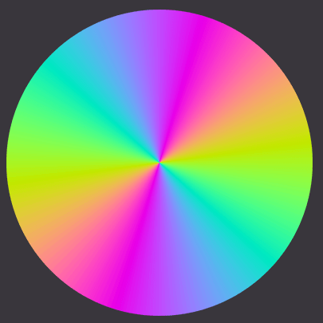

A `colorEffect()` shader that generates a constantly cycling color gradient, centered on the input view.

**Parameters:**

- `size`: The size of the whole image, in user-space.
- `time`: The number of elapsed seconds since the shader was created.

Example code:

```swift
struct ContentView: View {
    @State private var startTime = Date.now

    var body: some View {
        TimelineView(.animation) { timeline in
            let elapsedTime = startTime.distance(to: timeline.date)

            Image(systemName: "figure.walk.circle")
                .font(.system(size: 300))
                .visualEffect { content, proxy in
                    content
                        .colorEffect(
                            ShaderLibrary.animatedGradientFill(
                                .float2(proxy.size),
                                .float(elapsedTime)
                        )
                    )
                }
        }
    }
}
```

</details>

### Checkerboard

<details>
<summary> Details (Click to expand) </summary>

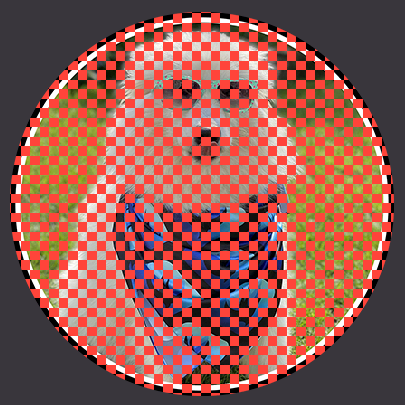

A `colorEffect()` shader that replaces the current image with a checkerboard pattern, flipping between the original color and a replacement.

**Parameters:**

- `replacement`: The replacement color to be used for checkered squares.
- `size`: The size of the checker squares.

Example code:

```swift
Image(systemName: "figure.walk.circle")
    .font(.system(size: 300))
    .colorEffect(
        ShaderLibrary.checkerboard(
            .color(.red),
            .float(50)
        )
    )
```

</details>

### Circle Wave

<details>
<summary> Details (Click to expand) </summary>

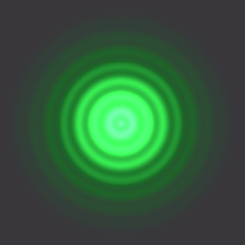

A `colorEffect()` shader that generates circular waves moving out or in, with varying size, brightness, speed, strength, and more.

**Parameters:**

- `size`: The size of the whole image, in user-space.
- `time`: The number of elapsed seconds since the shader was created.
- `brightness`: How bright the colors should be. Ranges from 0 to 5 work best; try starting with 0.5 and experiment.
- `speed`: How fast the wave should travel. Ranges from -2 to 2 work best, where negative numbers cause waves to come inwards; try starting with 1.
- `strength`: How intense the waves should be. Ranges from 0.02 to 5 work best; try starting with 2.
- `density`: How large each wave should be. Ranges from 20 to 500 work best; try starting with 100.
- `center`: The center of the effect, where 0.5/0.5 is dead center
- `circleColor`: The color to use for the waves. Use darker colors to create a less intense core.

Example code:

```swift
struct ContentView: View {
    @State private var startTime = Date.now

    var body: some View {
        TimelineView(.animation) { timeline in
            let elapsedTime = startTime.distance(to: timeline.date)

            Image(systemName: "figure.walk.circle")
                .font(.system(size: 300))
                .padding()
                .drawingGroup()
                .visualEffect { content, proxy in
                    content
                        .colorEffect(
                            ShaderLibrary.circleWave(
                                .float2(proxy.size),
                                .float(elapsedTime),
                                .float(0.5),
                                .float(1),
                                .float(2),
                                .float(100),
                                .float2(0.5, 0.5),
                                .color(.blue)
                            )
                        )
                }
        }
    }
}
```

</details>

### Color Planes

<details>
<summary> Details (Click to expand) </summary>

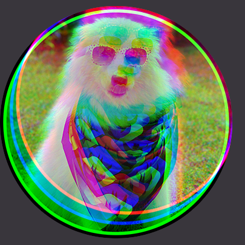

A `layerEffect()` shader that separates the RGB values for a pixel and offsets them to create a glitch-style effect. This works particularly well on iOS when the `offset` value is provided as through accelerometer data.

**Parameters:**

- `offset`: How much to offset colors by.

Example code:

```swift
struct ContentView: View {
    @State private var touchLocation = CGSize.zero

    var body: some View {
        Image(systemName: "figure.walk.circle")
            .font(.system(size: 300))
            .foregroundStyle(.white)
            .frame(maxWidth: .infinity, maxHeight: .infinity)
            .background(.black)
            .drawingGroup()
            .layerEffect(
                ShaderLibrary.colorPlanes(
                    .float2(touchLocation)
                ),
                maxSampleOffset: .zero
            )
            .gesture(
                DragGesture(minimumDistance: 0)
                    .onChanged { touchLocation = $0.translation }
            )
    }
}
```

</details>

### Emboss

<details>
<summary> Details (Click to expand) </summary>

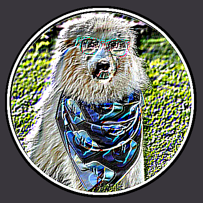

A `layerEffect()` shader that creates an embossing effect by adding brightness from pixels in one direction, and subtracting brightness from pixels in the other direction.

**Parameters:**

- `strength`: How far we should we read pixels to create the effect.

Example code:

```swift
struct ContentView: View {
    @State private var embossAmount = 0.0

    var body: some View {
        VStack {
            Text("🏳️‍🌈")
                .font(.system(size: 300))
                .layerEffect(
                    ShaderLibrary.emboss(
                        .float(embossAmount)
                    ),
                    maxSampleOffset: .zero
                )

            Slider(value: $embossAmount, in: 0...20)
                .padding()
        }
    }
}
```

</details>

### Gradient Fill

<details>
<summary> Details (Click to expand) </summary>

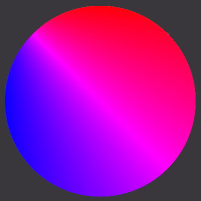

A `colorEffect()` shader that generates a gradient fill

**Parameters:**

- None.

Example code:

```swift
Image(systemName: "figure.walk.circle")
    .font(.system(size: 300))
    .colorEffect(
        ShaderLibrary.gradientFill()
    )
```

</details>

### Infrared

<details>
<summary> Details (Click to expand) </summary>

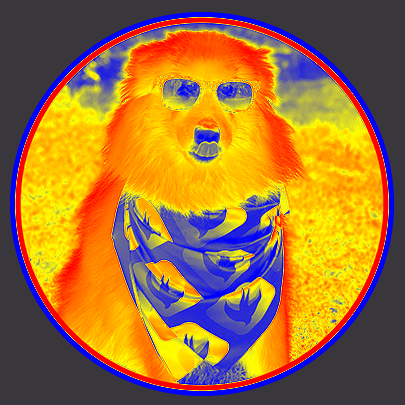

Simulates an infrared camera by coloring brighter objects red and darker objects blue.

**Parameters:**

- None.

Example code:

```swift
Text("👩‍💻")
    .font(.system(size: 300))
    .colorEffect(
        ShaderLibrary.infrared()
    )
```

</details>

### Interlace

<details>
<summary> Details (Click to expand) </summary>

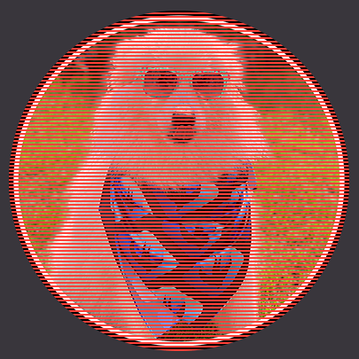

A `colorEffect()` shader that applies an interlacing effect where horizontal lines of the original color are separated by lines of another color.

**Parameters:**

- `width`: The width of the interlacing lines. Ranges of 1 to 4 work best; try starting with 1.
- `replacement`: The color to use for interlacing lines. Try starting with black.
- `strength`: How much to blend interlaced lines with color. Specify 0 (not at all) up to 1 (fully).

Example code:

```swift
Image(systemName: "figure.walk.circle")
    .font(.system(size: 300))
    .foregroundStyle(.red)
    .colorEffect(
        ShaderLibrary.interlace(
            .float(2),
            .color(.black),
            .float(1)
        )
    )
```

</details>

### Invert Alpha

<details>
<summary> Details (Click to expand) </summary>


A `colorEffect()` shader that inverts the alpha of an image, replacing transparent colors with a supplied color.

**Parameters:**

- `replacement`: The replacement color to use for pixels.

Example code:

```swift
Text("🤷‍♂️")
    .font(.system(size: 300))
    .colorEffect(
        ShaderLibrary.invertAlpha(
            .color(.red)
        )
    )
```

</details>

### Light Grid

<details>
<summary> Details (Click to expand) </summary>

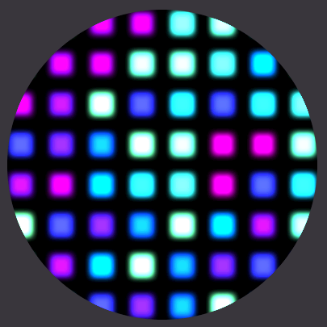

A `colorEffect()` shader that generates multiple twisting and turning lines that cycle through colors.

**Parameters:**

- `size`: The size of the whole image, in user-space.
- `time`: The number of elapsed seconds since the shader was created
- `density`: How many rows and columns to create. A range of 1 to 50 works well; try starting with 8.
- `speed`: How fast to make the lights vary their color. Higher values cause lights to flash faster and vary in color more. A range of 1 to 20 works well; try starting with 3.
- `groupSize`: How many lights to place in each group. A range of 1 to 8 works well depending on your density; starting with 1.
- `brightness`: How bright to make the lights. A range of 0.2 to 10 works well; try starting with 3.

Example code:

```swift
struct ContentView: View {
    @State private var startTime = Date.now

    var body: some View {
        TimelineView(.animation) { timeline in
            let elapsedTime = startTime.distance(to: timeline.date)

            Image(systemName: "figure.walk.circle")
                .font(.system(size: 300))
                .padding()
                .drawingGroup()
                .visualEffect { content, proxy in
                    content
                        .colorEffect(
                            ShaderLibrary.lightGrid(
                                .float2(proxy.size),
                                .float(elapsedTime),
                                .float(8),
                                .float(3),
                                .float(1),
                                .float(3)
                            )
                        )
                }
        }
    }
}
```

</details>

### Passthrough

<details>
<summary> Details (Click to expand) </summary>

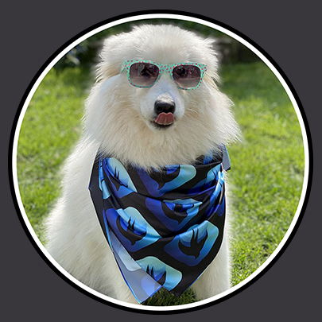

A `colorEffect()` shader that sends back the existing color data, changing nothing.

**Parameters:**

- None.

Example code:

```swift
Text("🏳️‍🌈")
    .font(.system(size: 300))
    .colorEffect(
        ShaderLibrary.passthrough()
    )
```

</details>

### Rainbow Noise

<details>
<summary> Details (Click to expand) </summary>

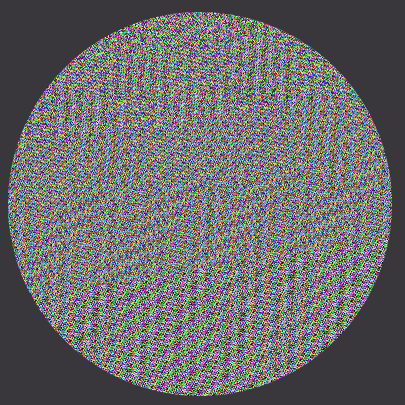

A `colorEffect()` shader that generates dynamic, multi-colored noise.

**Parameters:**

- `time`: The number of elapsed seconds since the shader was created.

Example code:

```swift
struct ContentView: View {
    @State private var startTime = Date.now

    var body: some View {
        TimelineView(.animation) { timeline in
            let elapsedTime = startTime.distance(to: timeline.date)

            Image(systemName: "figure.walk.circle")
                .font(.system(size: 300))
                .colorEffect(
                    ShaderLibrary.rainbowNoise(
                        .float(elapsedTime)
                    )
                )
        }
    }
}
```

</details>

### Recolor

<details>
<summary> Details (Click to expand) </summary>


A `colorEffect()` that changes input colors to a replacement, while respecting the current alpha value.

**Parameters:**

- `replacement`: The replacement color to use for pixels.

Example code:

```swift
Text("💪")
    .font(.system(size: 300))
    .colorEffect(
        ShaderLibrary.recolor(
            .color(.blue)
        )
    )
```

</details>

### Relative Wave

<details>
<summary> Details (Click to expand) </summary>

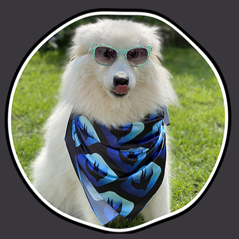

A `distortionEffect()` shader that generates a wave effect, where no effect is applied on the left side of the input, and the full effect is applied on the right side.

**Parameters:**

- `size`: The size of the whole image, in user-space.
- `time`: The number of elapsed seconds since the shader was created.
- `speed`: How fast to make the waves ripple. Try starting with a value of 5.
- `smoothing`: How much to smooth out the ripples, where greater values produce a smoother effect. Try starting with a value of 20.
- `strength`: How pronounced to make the ripple effect. Try starting with a value of 5.

Example code:

```swift
struct ContentView: View {
    @State private var startTime = Date.now

    var body: some View {
        TimelineView(.animation) { timeline in
            let elapsedTime = startTime.distance(to: timeline.date)

            Image(systemName: "figure.walk.circle")
                .font(.system(size: 300))
                .padding()
                .background(.background)
                .drawingGroup()
                .visualEffect { content, proxy in
                    content
                        .distortionEffect(
                            ShaderLibrary.relativeWave(
                                .float2(proxy.size),
                                .float(elapsedTime),
                                .float(5),
                                .float(20),
                                .float(5)
                            ),
                            maxSampleOffset: .zero
                        )
                }
        }
    }
}
```

</details>

### Simple Loupe

<details>
<summary> Details (Click to expand) </summary>

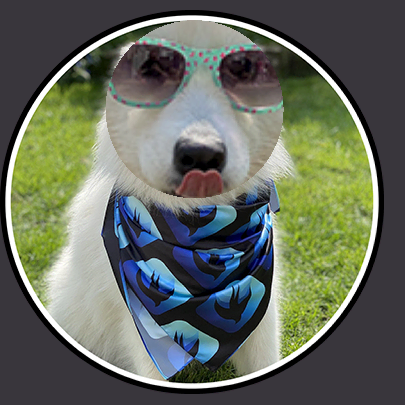

A `layerEffect()` shader that creates a circular zoom effect over a precise location.

**Parameters:**

- `size`: The size of the whole image, in user-space.
- `touch`: The location the user is touching, where the zoom should be centered.
- `maxDistance`: How big to make the zoomed area. Try starting with 0.05.
- `zoomFactor`: How much to zoom the contents of the loupe.

Example code:

```swift
struct ContentView: View {
    @State private var touchLocation = CGPoint.zero

    var body: some View {
        Image(systemName: "figure.walk.circle")
            .font(.system(size: 300))
            .padding()
            .background(.background)
            .drawingGroup()
            .visualEffect { content, proxy in
                content
                    .layerEffect(
                        ShaderLibrary.simpleLoupe(
                            .float2(proxy.size),
                            .float2(touchLocation),
                            .float(0.05),
                            .float(2)
                        ),
                        maxSampleOffset: .zero
                    )
            }
            .gesture(
                DragGesture(minimumDistance: 0)
                    .onChanged { touchLocation = $0.location }
            )
    }
}
```

</details>

### Sinebow

<details>
<summary> Details (Click to expand) </summary>

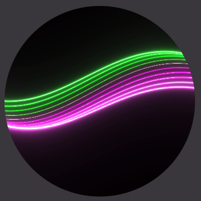

A `colorEffect()` shader that generates multiple twisting and turning lines that cycle through colors.

**Parameters:**

- `size`: The size of the whole image, in user-space.
- `time`: The number of elapsed seconds since the shader was created.

Example code:

```swift
struct ContentView: View {
    @State private var startTime = Date.now

    var body: some View {
        TimelineView(.animation) { timeline in
            let elapsedTime = startTime.distance(to: timeline.date)

            Rectangle()
                .visualEffect { content, proxy in
                    content
                        .colorEffect(
                            ShaderLibrary.sinebow(
                                .float2(proxy.size),
                                .float(elapsedTime)
                            )
                        )
                }
        }
    }
}
```

</details>

### Warping Loupe

<details>
<summary> Details (Click to expand) </summary>

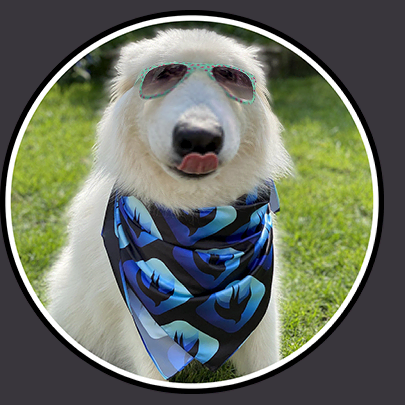

A `layerEffect()` shader that creates a circular zoom effect over a precise location, with variable zoom around the touch area to create a glass orb-like effect.

**Parameters:**

- `size`: The size of the whole image, in user-space.
- `touch`: The location the user is touching, where the zoom should be centered.
- `maxDistance`: How big to make the zoomed area. Try starting with 0.05.
- `zoomFactor`: How much to zoom the contents of the loupe.

Example code:

```swift
struct ContentView: View {
    @State private var touchLocation = CGPoint.zero

    var body: some View {
        Image(systemName: "figure.walk.circle")
            .font(.system(size: 300))
            .padding()
            .background(.background)
            .drawingGroup()
            .visualEffect { content, proxy in
                content
                    .layerEffect(
                        ShaderLibrary.warpingLoupe(
                            .float2(proxy.size),
                            .float2(touchLocation),
                            .float(0.05),
                            .float(2)
                        ),
                        maxSampleOffset: .zero
                    )
            }
            .gesture(
                DragGesture(minimumDistance: 0)
                    .onChanged { touchLocation = $0.location }
            )
    }
}
```

</details>

### Water

<details>
<summary> Details (Click to expand) </summary>

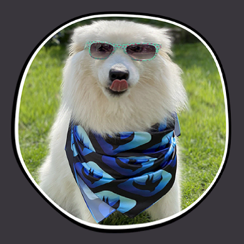

A `distortionEffect()` shader that generates a water rippling effect.

**Parameters:**

- `size`: The size of the whole image, in user-space.
- `time`: The number of elapsed seconds since the shader was created.
- `speed`: How fast to make the water ripple. Ranges from 0.5 to 10 work best; try starting with 3.
- `strength`: How pronounced the rippling effect should be. Ranges from 1 to 5 work best; try starting with 3.
- `frequency`: How often ripples should be created. Ranges from 5 to 25 work best; try starting with 10.

Example code:

```swift
struct ContentView: View {
    @State private var startTime = Date.now

    var body: some View {
        TimelineView(.animation) { timeline in
            let elapsedTime = startTime.distance(to: timeline.date)

            Image(systemName: "figure.walk.circle")
                .font(.system(size: 300))
                .padding()
                .background(.background)
                .drawingGroup()
                .visualEffect { content, proxy in
                    content
                        .distortionEffect(
                            ShaderLibrary.water(
                                .float2(proxy.size),
                                .float(elapsedTime),
                                .float(3),
                                .float(3),
                                .float(10)
                            ),
                            maxSampleOffset: .zero
                        )
                }
        }
    }
}
```

</details>

### Wave

<details>
<summary> Details (Click to expand) </summary>

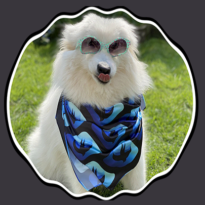

A `distortionEffect()` shader that generates a wave effect, where no effect is applied on the left side of the input, and the full effect is applied on the right side.

**Parameters:**

- `time`: The number of elapsed seconds since the shader was created.
- `speed`: How fast to make the waves ripple. Try starting with a value of 5.
- `smoothing`: How much to smooth out the ripples, where greater values produce a smoother effect. Try starting with a value of 10.
- `strength`: How pronounced to make the ripple effect. Try starting with a value of 5.

Example code:

```swift
struct ContentView: View {
    @State private var startTime = Date.now

    var body: some View {
        TimelineView(.animation) { timeline in
            let elapsedTime = startTime.distance(to: timeline.date)

            Image(systemName: "figure.walk.circle")
                .font(.system(size: 300))
                .padding()
                .background(.background)
                .drawingGroup()
                .distortionEffect(
                    ShaderLibrary.wave(
                        .float(elapsedTime),
                        .float(5),
                        .float(10),
                        .float(5)
                    ),
                    maxSampleOffset: .zero
                )
        }
    }
}
```

</details>

### White Noise

<details>
<summary> Details (Click to expand) </summary>

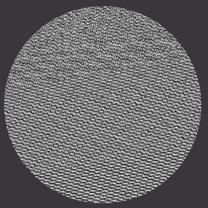

A `colorEffect()` shader that generates dynamic, grayscale noise.

**Parameters:**

- `time`: The number of elapsed seconds since the shader was created.

Example code:

```swift
struct ContentView: View {
    @State private var startTime = Date.now

    var body: some View {
        TimelineView(.animation) { timeline in
            let elapsedTime = startTime.distance(to: timeline.date)

            Image(systemName: "figure.walk.circle")
                .font(.system(size: 300))
                .colorEffect(
                    ShaderLibrary.whiteNoise(
                        .float(elapsedTime)
                    )
                )
        }
    }
}
```

</details>
</details>

## Transitions included in Inferno

<details>
<summary> Details (Click to expand) </summary>

As well as the shaders listed above, Inferno provides a selection of shaders specifically designed to be used as transitions. Although these are still Metal shaders internally, you'll use them through `AnyTransition` extensions that make the process seamless.

> [!Tip]
> As well as copying one specific shader into your project, you should also add Transitions.swift to include the `AnyTransition` extensions.

### Circle

<details>
<summary> Details (Click to expand) </summary>

A transition where many circles grow upwards to reveal the new content.

**Parameters:**

- `size`: How big to make the circles.

Example code:

```swift
struct ContentView: View {
    @State private var showingFirstView = true

    var body: some View {
        VStack {
            if showingFirstView {
                Image(systemName: "figure.walk.circle")
                    .font(.system(size: 300))
                    .foregroundStyle(.white)
                    .padding()
                    .background(.blue)
                    .drawingGroup()
                    .transition(.circles(size: 20))
            } else {
                Image(systemName: "figure.run.circle")
                    .font(.system(size: 300))
                    .foregroundStyle(.white)
                    .padding()
                    .background(.indigo)
                    .drawingGroup()
                    .transition(.circles(size: 20))
            }

            Button("Toggle Views") {
                withAnimation(.easeIn(duration: 1.5)) {
                    showingFirstView.toggle()
                }
            }
        }
    }
}
```

</details>

### Circle Wave

<details>
<summary> Details (Click to expand) </summary>

A transition where many circles grow upwards to reveal the new content, with the circles moving outwards from the top-left edge.

**Parameters:**

- `size`: How big to make the circles.

Example code:

```swift
struct ContentView: View {
    @State private var showingFirstView = true

    var body: some View {
        VStack {
            if showingFirstView {
                Image(systemName: "figure.walk.circle")
                    .font(.system(size: 300))
                    .foregroundStyle(.white)
                    .padding()
                    .background(.blue)
                    .drawingGroup()
                    .transition(.circleWave(size: 20))
            } else {
                Image(systemName: "figure.run.circle")
                    .font(.system(size: 300))
                    .foregroundStyle(.white)
                    .padding()
                    .background(.indigo)
                    .drawingGroup()
                    .transition(.circleWave(size: 20))
            }

            Button("Toggle Views") {
                withAnimation(.easeIn(duration: 1.5)) {
                    showingFirstView.toggle()
                }
            }
        }
    }
}
```

</details>

### Crosswarp LTR

<details>
<summary> Details (Click to expand) </summary>

A transition that stretches and fades pixels starting from the left edge.

**Parameters:**

- None.

Example code:

```swift
struct ContentView: View {
    @State private var showingFirstView = true

    var body: some View {
        VStack {
            if showingFirstView {
                Image(systemName: "figure.walk.circle")
                    .font(.system(size: 300))
                    .foregroundStyle(.white)
                    .padding()
                    .background(.blue)
                    .drawingGroup()
                    .transition(.crosswarpLTR)
            } else {
                Image(systemName: "figure.run.circle")
                    .font(.system(size: 300))
                    .foregroundStyle(.white)
                    .padding()
                    .background(.indigo)
                    .drawingGroup()
                    .transition(.crosswarpLTR)
            }

            Button("Toggle Views") {
                withAnimation(.easeIn(duration: 1.5)) {
                    showingFirstView.toggle()
                }
            }
        }
    }
}
```

</details>

### Crosswarp RTL

<details>
<summary> Details (Click to expand) </summary>

A transition that stretches and fades pixels starting from the right edge.

**Parameters:**

- None.

Example code:

```swift
struct ContentView: View {
    @State private var showingFirstView = true

    var body: some View {
        VStack {
            if showingFirstView {
                Image(systemName: "figure.walk.circle")
                    .font(.system(size: 300))
                    .foregroundStyle(.white)
                    .padding()
                    .background(.blue)
                    .drawingGroup()
                    .transition(.crosswarpRTL)
            } else {
                Image(systemName: "figure.run.circle")
                    .font(.system(size: 300))
                    .foregroundStyle(.white)
                    .padding()
                    .background(.indigo)
                    .drawingGroup()
                    .transition(.crosswarpRTL)
            }

            Button("Toggle Views") {
                withAnimation(.easeIn(duration: 1.5)) {
                    showingFirstView.toggle()
                }
            }
        }
    }
}
```

</details>

### Diamond

<details>
<summary> Details (Click to expand) </summary>

A transition that makes a variety of diamonds simultaneously zoom up across the screen.

**Parameters:**

- `size`: How big to make the diamonds.

Example code:

```swift
struct ContentView: View {
    @State private var showingFirstView = true

    var body: some View {
        VStack {
            if showingFirstView {
                Image(systemName: "figure.walk.circle")
                    .font(.system(size: 300))
                    .foregroundStyle(.white)
                    .padding()
                    .background(.blue)
                    .drawingGroup()
                    .transition(.diamonds(size: 20))
            } else {
                Image(systemName: "figure.run.circle")
                    .font(.system(size: 300))
                    .foregroundStyle(.white)
                    .padding()
                    .background(.indigo)
                    .drawingGroup()
                    .transition(.diamonds(size: 20))
            }

            Button("Toggle Views") {
                withAnimation(.easeIn(duration: 1.5)) {
                    showingFirstView.toggle()
                }
            }
        }
    }
}
```

</details>

### Diamond Wave

<details>
<summary> Details (Click to expand) </summary>

A transition that makes a variety of circles zoom up across the screen, based on their X/Y position.

**Parameters:**

- `size`: How big to make the diamonds. Defaults to 20.

Example code:

```swift
struct ContentView: View {
    @State private var showingFirstView = true

    var body: some View {
        VStack {
            if showingFirstView {
                Image(systemName: "figure.walk.circle")
                    .font(.system(size: 300))
                    .foregroundStyle(.white)
                    .padding()
                    .background(.blue)
                    .drawingGroup()
                    .transition(.diamondWave(size: 20))
            } else {
                Image(systemName: "figure.run.circle")
                    .font(.system(size: 300))
                    .foregroundStyle(.white)
                    .padding()
                    .background(.indigo)
                    .drawingGroup()
                    .transition(.diamondWave(size: 20))
            }

            Button("Toggle Views") {
                withAnimation(.easeIn(duration: 1.5)) {
                    showingFirstView.toggle()
                }
            }
        }
    }
}
```

</details>

### Pixellate

<details>
<summary> Details (Click to expand) </summary>

A transition that causes the incoming and outgoing views to become increasingly pixellated, then return to their normal state. While this happens the old view fades out and the new one fades in.

**Parameters:**

- `squares`: How large the pixels should be. Defaults to 20.
- `steps`: How many steps to use for the animation. Lower values make the pixels jump in more noticeable size increments, which creates very interesting retro effects. Defaults to 60.

Example code:

```swift
struct ContentView: View {
    @State private var showingFirstView = true

    var body: some View {
        VStack {
            if showingFirstView {
                Image(systemName: "figure.walk.circle")
                    .font(.system(size: 300))
                    .foregroundStyle(.white)
                    .padding()
                    .background(.blue)
                    .drawingGroup()
                    .transition(.pixellate(squares: 20, steps: 20))
            } else {
                Image(systemName: "figure.run.circle")
                    .font(.system(size: 300))
                    .foregroundStyle(.white)
                    .padding()
                    .background(.indigo)
                    .drawingGroup()
                    .transition(.pixellate(squares: 20, steps: 20))
            }

            Button("Toggle Views") {
                withAnimation(.easeIn(duration: 1.5)) {
                    showingFirstView.toggle()
                }
            }
        }
    }
}
```

</details>

### Radial

<details>
<summary> Details (Click to expand) </summary>

A transition that creates an old-school radial wipe, starting from straight up.

**Parameters:**

- None.

Example code:

```swift
struct ContentView: View {
    @State private var showingFirstView = true

    var body: some View {
        VStack {
            if showingFirstView {
                Image(systemName: "figure.walk.circle")
                    .font(.system(size: 300))
                    .foregroundStyle(.white)
                    .padding()
                    .background(.blue)
                    .drawingGroup()
                    .transition(.radial)
            } else {
                Image(systemName: "figure.run.circle")
                    .font(.system(size: 300))
                    .foregroundStyle(.white)
                    .padding()
                    .background(.indigo)
                    .drawingGroup()
                    .transition(.radial)
            }

            Button("Toggle Views") {
                withAnimation(.easeIn(duration: 1.5)) {
                    showingFirstView.toggle()
                }
            }
        }
    }
}
```

</details>

### Swirl

<details>
<summary> Details (Click to expand) </summary>

A transition that increasingly twists the contents of the incoming and outgoing views, then untwists them to complete the transition. As this happens the two views fade to move smoothly from one to the other.

**Parameters:**

- `radius`: How large the swirl should be relative to the view it's transitioning. Defaults to 0.5.

Example code:

```swift
struct ContentView: View {
    @State private var showingFirstView = true

    var body: some View {
        VStack {
            if showingFirstView {
                Image(systemName: "figure.walk.circle")
                    .font(.system(size: 300))
                    .foregroundStyle(.white)
                    .padding()
                    .background(.blue)
                    .drawingGroup()
                    .transition(.swirl(radius: 0.5))
            } else {
                Image(systemName: "figure.run.circle")
                    .font(.system(size: 300))
                    .foregroundStyle(.white)
                    .padding()
                    .background(.indigo)
                    .drawingGroup()
                    .transition(.swirl(radius: 0.5))
            }

            Button("Toggle Views") {
                withAnimation(.easeIn(duration: 1.5)) {
                    showingFirstView.toggle()
                }
            }
        }
    }
}
```

</details>

### Wind

<details>
<summary> Details (Click to expand) </summary>

A transition that makes it look the pixels of one image are being blown away horizontally.

**Parameters:**

- `size`: How big the wind streaks should be, relative to the view's width. Defaults to 0.2.

Example code:

```swift
struct ContentView: View {
    @State private var showingFirstView = true

    var body: some View {
        VStack {
            if showingFirstView {
                Image(systemName: "figure.walk.circle")
                    .font(.system(size: 300))
                    .foregroundStyle(.white)
                    .padding()
                    .background(.blue)
                    .drawingGroup()
                    .transition(.wind())
            } else {
                Image(systemName: "figure.run.circle")
                    .font(.system(size: 300))
                    .foregroundStyle(.white)
                    .padding()
                    .background(.indigo)
                    .drawingGroup()
                    .transition(.wind())
            }

            Button("Toggle Views") {
                withAnimation(.easeIn(duration: 1.5)) {
                    showingFirstView.toggle()
                }
            }
        }
    }
}
```

</details>

### Genie
<details>
<summary> Details (Click to expand) </summary>

A transition that makes it look like the view is getting sucked into a corner.
</details>
</details>

## Inferno Sandbox

Inside this repository is an example SwiftUI project for macOS that demonstrate each of the shaders with some example values – try running them if you’re curious how each of the shaders look or perform.

If you’ve modified one of the shaders and want to see how it looks, the sandbox is the best place. If you click the "Toggle Opacity" toolbar button, preview content will alternate between opacity 0 and 1 so you can make sure your modifications blend correctly.

All shaders here work great on all devices that support macOS Sonoma and coordinated releases, including iOS 17.

> [!Tip]
> Although the sandbox is helpful for previewing shaders, almost all its code isn't required in order to use Inferno shaders in your own projects – you just need to copy the relevant Metal files across, and optionally also Transitions.swift if you're using a transition shader.

## Contributing

I made Inferno because not enough people know that shaders are powerful, easy ways to add special effects to your apps. If you’d like to contribute your own shaders or modifications to existing shaders, that’s great! But first please read the following:

- Inferno has a strong emphasis on readability. Beginners should be able to read most of these shaders and have a good idea of how they work. If you want to make one of the shaders faster, please don’t do so at the expensive of readability.
- You must comment your code thoroughly. Shaders are often extremely terse, so please write in English above every line what the code does – a transliteration, if you will – and also provide a description of how it all works to produce the final result.
- All code must be licensed under the MIT license so it can benefit the most people.
- Please add your code to the Inferno Sandbox app, so folks can try it out easily.

## License

MIT License.

Copyright (c) 2023 Paul Hudson and other authors.

Permission is hereby granted, free of charge, to any person obtaining a copy of this software and associated documentation files (the "Software"), to deal in the Software without restriction, including without limitation the rights to use, copy, modify, merge, publish, distribute, sublicense, and/or sell copies of the Software, and to permit persons to whom the Software is furnished to do so, subject to the following conditions:

The above copyright notice and this permission notice shall be included in all copies or substantial portions of the Software.

THE SOFTWARE IS PROVIDED "AS IS", WITHOUT WARRANTY OF ANY KIND, EXPRESS OR IMPLIED, INCLUDING BUT NOT LIMITED TO THE WARRANTIES OF MERCHANTABILITY, FITNESS FOR A PARTICULAR PURPOSE AND NONINFRINGEMENT. IN NO EVENT SHALL THE AUTHORS OR COPYRIGHT HOLDERS BE LIABLE FOR ANY CLAIM, DAMAGES OR OTHER LIABILITY, WHETHER IN AN ACTION OF CONTRACT, TORT OR OTHERWISE, ARISING FROM, OUT OF OR IN CONNECTION WITH THE SOFTWARE OR THE USE OR OTHER DEALINGS IN THE SOFTWARE.

Inferno was made by [Paul Hudson](https://twitter.com/twostraws), who writes [free Swift tutorials over at Hacking with Swift](https://www.hackingwithswift.com). It’s available under the MIT license, which permits commercial use, modification, distribution, and private use.

Some shaders were ported to Metal by me, from other open-source samples also released under the MIT license. All credit for their code goes to their original authors; all mistakes and similar are obviously my fault!

- Circle, Circle Wave, Diamond, Diamond Wave are based on [Polka Dots Curtain](https://gl-transitions.com/editor/PolkaDotsCurtain) by bobylito.
- Crosswarp is based on [Crosswarp](https://gl-transitions.com/editor/crosswarp) by Eke Péter.
- Radial is based on [Radial](https://gl-transitions.com/editor/Radial) by Xaychru / gre.
- Swirl is based on [Swirl](https://gl-transitions.com/editor/Swirl) by Sergey Kosarevsky / gre.
- Wind is based on [Wind](https://gl-transitions.com/editor/wind) by gre.
- Genie is based on [Mac Genie Effecty](https://www.shadertoy.com/view/flyfRt) by altaha-ansari.

## Where to learn more

If you're keen to learn more about Metal shaders, here are the resources I recommend:

- [The Book of Shaders](https://www.thebookofshaders.com) has taught countless thousands of people how to build shaders, and contains comprehensive descriptions. Note: This is written for GLSL, but the concepts still apply to Metal.
- [ShaderToy](https://www.shadertoy.com) contains all sorts of fantastic shader ideas where you gain inspiration, plus all their code is there to learn from. Again this is written for GLSL, but you can transfer to Metal.
- [GL Transitions](https://www.gl-transitions.com) contains a variety of open-source GLSL transitions for inspiration.
- [Apple's Metal documentation](https://developer.apple.com/metal) goes into great detail on the many other usages of Metal – we've just covered fragment shaders here, but it can do so much more!
- [Hacking with Swift+](https://www.hackingwithswift.com/plus) contains a tutorial series teaching how to build Metal shaders for use with SwiftUI, going into much more depth on how the shaders actually work.

<p align="center">
    <a href="https://www.hackingwithswift.com/plus">
    </a>
</p>

<p align="center">&nbsp;</p>

<p align="center">
    <a href="https://www.hackingwithswift.com"></a><br />
    A Hacking with Swift Project
</p>
